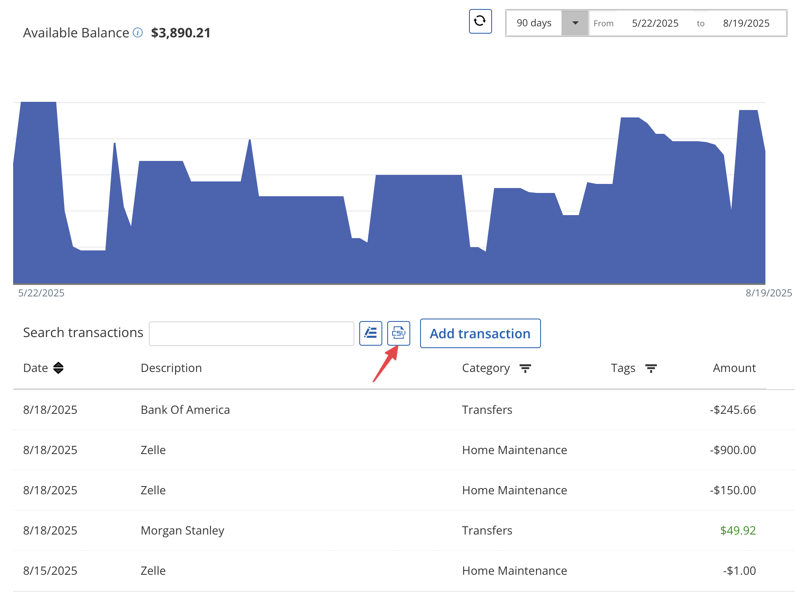
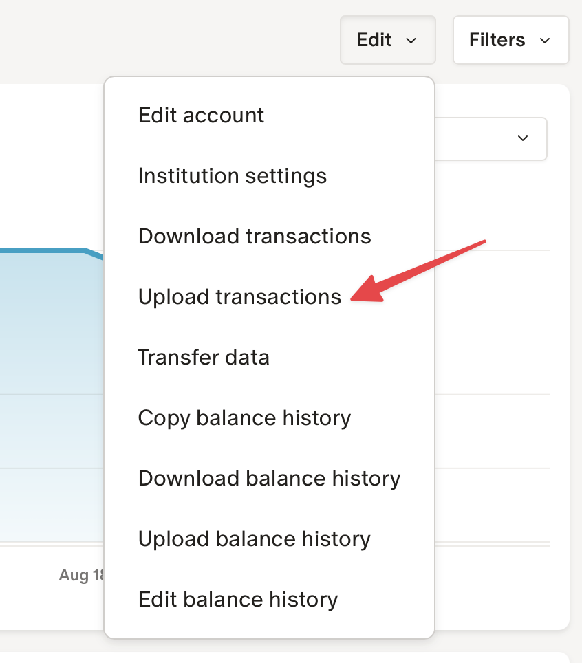

# Personal Capital to Monarch Money Migration Tool

A comprehensive Python script that converts Personal Capital CSV transaction exports to the format required by Monarch Money, with category mapping support and flexible configuration options.

## ⚠️ Important Disclaimer

**FOR PERSONAL USE ONLY:** This tool is provided for personal, non-commercial use in migrating your own financial data from Personal Capital to Monarch Money. 

**LIMITATION OF LIABILITY:** The author(s) of this tool are not liable for any data loss, corruption, or damage that may occur during the migration process. You are solely responsible for:
- Backing up your original data before migration
- Verifying the accuracy of converted transactions
- Any consequences resulting from the use of this tool

**USE AT YOUR OWN RISK:** By using this software, you acknowledge that financial data migration carries inherent risks and you accept full responsibility for any outcomes. Always verify your data before importing into Monarch Money.

## 🚀 Quick Start

0. **Get the script:**
   
   **Option A: Download ZIP (Easiest)**
   - Go to https://github.com/krthk/personal-capital-to-monarch-migrator
   - Click the green "Code" button → "Download ZIP"
   - Extract the ZIP file to your desired location
   - Open Terminal/Command Prompt and navigate to the extracted folder
   
   **Option B: Git Clone**
   ```bash
   git clone https://github.com/krthk/personal-capital-to-monarch-migrator.git
   cd personal-capital-to-monarch-migrator
   ```

1. **Install dependencies:**
   ```bash
   pip install PyYAML
   ```
   
   > **Note:** Only PyYAML is required for basic usage. The `requirements-dev.txt` file contains additional development dependencies (testing, code quality tools) that are only needed if you plan to modify or contribute to the code.

2. **Prepare your data:**
   
   **Export from Personal Capital:**
   - Log into your Personal Capital account
   - Navigate to the account you want to export
   - Look for export or download options (usually in account settings or transaction view)
   - Download transactions as CSV format
   
   > ⚠️ **Note:** Personal Capital's interface may change over time. If you cannot locate the export options as described, check their current help documentation or contact their support.
   
   
   *Personal Capital transaction view showing the CSV export button (highlighted with arrow)*
   
   **Organize your files:**
   - Place the downloaded CSV files in the `input/` directory (or specify custom directory with `-i`)
   - You can export multiple accounts - the script will process all CSV files in the directory

3. **Run the migration:**
   ```bash
   python migrate_pc_to_monarch.py
   ```

4. **Import to Monarch:**
   
   **Locate your converted files:**
   - Find converted files in the `output/` directory
   - Each file will be named `[original-filename]-monarch.csv`
   
   **Upload to Monarch Money:**
   - Log into your Monarch Money account
   - Navigate to the account you want to import to
   - Go to account details → Edit → Upload transactions → Upload CSV
   - Select the corresponding `*-monarch.csv` file for each account
   - Review and confirm the import
   
   > ⚠️ **Note:** Monarch Money's interface may change over time. If you cannot locate the upload options as described, check their current help documentation or contact their support.
   
   
   *Monarch Money account edit menu showing "Upload transactions" option (highlighted with arrow)*
   
   **Verify your data:**
   - Check that all transactions imported correctly
   - Verify account balances match your expectations
   - Review category assignments and adjust if needed

## 🔧 Command-Line Options

### Basic Usage
```bash
python migrate_pc_to_monarch.py [options]
```

### Available Options

| Option | Short | Description | Default |
|--------|-------|-------------|---------|
| `--help` | `-h` | Show help message and exit | |
| `--input-dir` | `-i` | Input directory containing PC CSV files | `./input` |
| `--output-dir` | `-o` | Output directory for Monarch CSV files | `./output` |
| `--config` | `-c` | Custom YAML configuration file | `./config.yaml` |
| `--version` | `-v` | Show version information | |

### Usage Examples

**Default directories:**
```bash
python migrate_pc_to_monarch.py
```

**Custom directories:**
```bash
python migrate_pc_to_monarch.py -i ~/Downloads/PC_Exports -o ~/Desktop/Monarch_Files
```

**Custom configuration:**
```bash
python migrate_pc_to_monarch.py --config my_custom_mappings.yaml
```

**Absolute paths:**
```bash
python migrate_pc_to_monarch.py -i /Users/name/Documents/PersonalCapital -o /Users/name/Documents/MonarchReady
```

## 📋 Supported Personal Capital Formats

The script automatically detects and handles two Personal Capital export formats:

### Format 1: Investment Accounts
- **Columns:** Date, Description, Category, Action, Quantity, Price, Amount
- **Use case:** Stock purchases, sales, dividends, investment transactions
- **Features:** Maps Action field to Monarch Notes column

### Format 2: Standard Accounts  
- **Columns:** Date, Description, Category, Tags, Amount
- **Use case:** Checking, credit card, standard transaction accounts
- **Features:** Preserves Tags field in Monarch format

## 🎯 Monarch Money Output Format

The script converts all transactions to Monarch's required 8-column format:

| Column | Description | Source |
|--------|-------------|--------|
| Date | Transaction date | PC Date |
| Merchant | Business/entity name | PC Description |
| Category | Expense/income category | PC Category (mapped) |
| Account | Account name | *Empty - assign in Monarch* |
| Original Statement | Original description | PC Description |
| Notes | Additional notes | PC Action (Format 1) |
| Amount | Transaction amount | PC Amount |
| Tags | Transaction tags | PC Tags (Format 2) |

## ⚙️ Category Mapping Configuration

### Complete Coverage
The included `config.yaml` provides sensible mappings for **many common Personal Capital categories**:
- **Income categories** (Consulting, Paychecks/Salary, etc.)
- **Expense categories** (Gasoline/Fuel, Healthcare/Medical, etc.)  
- **Other categories** (Transfers, Balance Adjustments, etc.)

### Configuration Structure
```yaml
category_mappings:
  # Personal Capital Category -> Monarch Money Category
  "Gasoline/Fuel": "Gas"
  "Healthcare/Medical": "Medical"
  "Credit Card Payments": "Credit Card Payment"
  # ... 170+ mappings
  
advanced:
  case_sensitive_matching: false
```

### Customization
1. **Edit existing mappings:** Modify `config.yaml` to change how categories are mapped
2. **Add new mappings:** Add entries for any custom Personal Capital categories
3. **Create custom config:** Use `-c` flag to specify your own configuration file

### Key Features
- **Case-insensitive matching:** Works regardless of capitalization (configurable)
- **Fallback system:** Preserves unmapped categories unchanged  
- **Statistics:** Shows category remapping summary after conversion

## 📊 What the Script Does

1. **🔍 Discovery:** Finds all `.csv` files in input directory
2. **📋 Format Detection:** Automatically identifies PC export format  
3. **🔄 Category Mapping:** Applies comprehensive category conversions
4. **✅ Data Processing:** Ensures proper formatting and data integrity
5. **📤 Export:** Creates Monarch-compatible CSV files with `-monarch` suffix
6. **📈 Reporting:** Provides detailed conversion statistics and remapping summary

### Processing Features
- **Batch Processing:** Handles multiple CSV files in one run
- **Skip Duplicates:** Ignores already-converted files (ending in `-monarch.csv`)
- **Error Handling:** Continues processing other files if one fails
- **Progress Tracking:** Shows detailed progress and statistics
- **Data Preservation:** Maintains all original transaction data

## 🧪 Testing

The project includes a comprehensive test suite with 36 tests covering:

### Unit Tests
- Category mapping functionality
- Transaction transformation logic
- File format detection
- Data integrity validation
- Error handling scenarios

### Integration Tests
- End-to-end file conversion
- Directory management
- CLI argument processing
- Real data validation

### Run Tests
```bash
# Run all tests
python -m pytest tests/ -v

# Run with coverage
python -m pytest tests/ --cov=migrate_pc_to_monarch --cov-report=html

# Test specific functionality
python -m pytest tests/test_migrate_pc_to_monarch.py -v
```

## 🛠️ Development Setup

### Prerequisites
- Python 3.6+ (uses f-strings, pathlib, and typing module)
- PyYAML for configuration file parsing

### Installation
```bash
# Clone or download the project
git clone <repository-url>
cd pc-to-monarch-migration

# Install development dependencies
pip install -r requirements-dev.txt

# Verify installation
python migrate_pc_to_monarch.py --version
```

### Development Dependencies
- **PyYAML:** Configuration file parsing
- **pytest:** Testing framework
- **pytest-cov:** Test coverage reporting
- **pytest-mock:** Mock support for testing
- **flake8:** Code style checking

## 🔍 Troubleshooting

### Common Issues

**"Configuration file not found"**
- Ensure `config.yaml` exists in the project root
- Use `-c` flag to specify custom config file path
- Check file permissions

**"No Personal Capital CSV files found"**
- Verify CSV files are in the input directory
- Ensure files don't already end with `-monarch.csv`
- Use `-i` flag to specify correct input directory

**"Category mapping issues"**
- Check `config.yaml` for proper YAML syntax
- Verify category names match your PC export exactly
- Case-insensitive matching is enabled by default

**"Import errors in Monarch"**  
- Verify CSV files have exactly 8 columns
- Check date format compatibility
- Ensure amount fields are numeric

### Getting Help
1. **Check the help:** `python migrate_pc_to_monarch.py --help`
2. **Review configuration:** Examine `config.yaml` for mapping issues
3. **Test with sample data:** Use files in `tests/test_data/` to verify setup
4. **Run tests:** Execute test suite to verify installation

## 📈 Migration Statistics

After conversion, the script provides detailed statistics:
- **Files processed:** Number of CSV files converted
- **Total transactions:** Count of transactions migrated  
- **Category remappings:** Summary of how categories were transformed
- **Success rate:** Conversion success metrics

Example output:
```
🎉 Migration complete!
📊 Results Summary:
  • Files processed successfully: 3/3
  • Total transactions converted: 1,247
  • Output files saved in: /path/to/output

📋 Category Remapping Summary:
  • 156 transactions: 'Gasoline/Fuel' → 'Gas'
  • 89 transactions: 'Restaurants' → 'Restaurants & Bars'
  • 67 transactions: 'Healthcare/Medical' → 'Medical'
```

## 🤝 Contributing

Contributions are welcome! Areas for improvement:
- Additional category mappings for edge cases
- Enhanced error handling and validation
- Support for additional Personal Capital export formats
- Performance optimizations for large datasets

## 📄 License

This project is provided as-is for personal use in migrating from Personal Capital to Monarch Money.

---

**Version:** 2.0  
**Last Updated:** 2025  
**Compatibility:** Personal Capital exports, Monarch Money imports